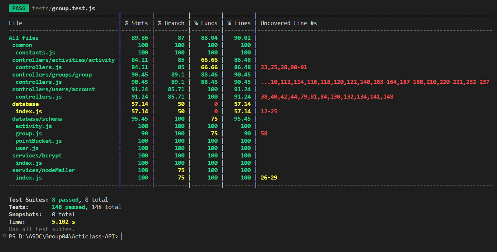
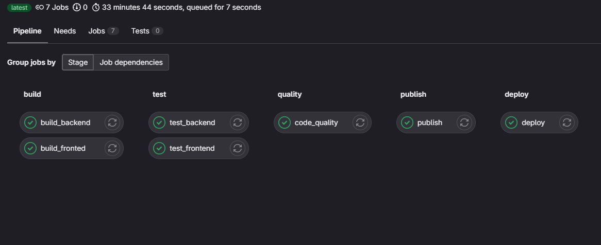
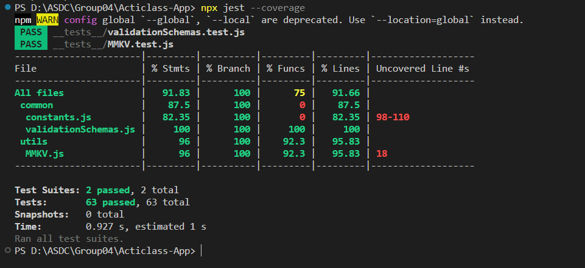

<center>

</center>

<div style="text-align: center">

# Acticlass

</div>

## Summary

Acticlass aims to enhance classroom interactivity through a versatile application. Teachers can create groups and facilitate student participation via QR codes. Gamification elements reward engagement, and students earn points by attending classes. Teachers control access based on physical presence. A leaderboard and CSV reports offer insights for an engaging learning experience.

[](https://img.shields.io/badge/pipeline-passed-green) [](https://img.shields.io/badge/test-passed-green) [](https://img.shields.io/badge/coverage->90%25-blue)

### Tech Stacks

[](https://img.shields.io/badge/JavaScript-ES6-yellow)
[](https://img.shields.io/badge/Node.js-v14.0-green)
[](https://img.shields.io/badge/MongoDB-v4.4.0-blue)
[](https://img.shields.io/badge/React_Native-v0.66.0-blue)
[](https://img.shields.io/badge/Express-v4.18.2-green)
[](https://img.shields.io/badge/GitLab-v14.0-orange)
[](https://img.shields.io/badge/CI/CD-GitLab_CI-orange)

---

## Backend (Node.js)

### Setup

1.  **Go to Acticlass-API**
    ```bash
     cd Acticlass-API
    ```
2.  **Dependencies**: Install dependencies using `npm install` in the Acticlass-API directory.

### Dependencies

| Dependency    | Version         | Description                                       | Installation Command              |
| ------------- | --------------- | ------------------------------------------------- | --------------------------------- |
| bcrypt        | ^5.1.1          | Library for hashing passwords                     | `npm install bcrypt@5.1.1`        |
| dotenv        | ^16.3.1         | Loads environment variables from a file           | `npm install dotenv@16.3.1`       |
| express       | ^4.18.2         | Web application framework for Node.js             | `npm install express@4.18.2`      |
| http          | ^0.0.1-security | HTTP module with security enhancements            | `npm install http@0.0.1-security` |
| http-status   | ^1.7.0          | Utility to interact with HTTP status codes        | `npm install http-status@1.7.0`   |
| jsonwebtoken  | ^9.0.2          | Implementation of JSON Web Tokens                 | `npm install jsonwebtoken@9.0.2`  |
| lodash        | ^4.17.21        | Utility library for JavaScript                    | `npm install lodash@4.17.21`      |
| moment        | ^2.29.4         | Date and time manipulation library                | `npm install moment@2.29.4`       |
| mongoose      | ^7.6.0          | MongoDB object modeling for Node.js               | `npm install mongoose@7.6.0`      |
| node-cache    | ^5.1.2          | In-memory caching for Node.js                     | `npm install node-cache@5.1.2`    |
| node-schedule | ^2.1.1          | Job scheduler for Node.js                         | `npm install node-schedule@2.1.1` |
| nodemailer    | ^6.9.6          | Email sending module for Node.js                  | `npm install nodemailer@6.9.6`    |
| socket.io     | ^4.7.2          | Real-time bidirectional event-based communication | `npm install socket.io@4.7.2`     |

### Environment

Create a `.env` file at root folder with the following variables:

```dotenv
PORT=
HOST_URL=
JWT_SECRET=
Email=
EMAIL_PASSWORD=
MONGO_DB_SRV=
SMTP_HOST=
SMTP_PORT=
SMTP_EMAIL=
SMTP_PASSWORD=
```

### Run

To start the application use the bellow code.

```bash
# Start node server
npm start
```

## Test Cases with Jest

### Setup Jest

1. **Install Jest**: If Jest isn't already installed, add it to your project:

   ```bash
   npm install --save-dev jest
   ```

2. **Create Test Files**: Create a `tests` directory in your project's root or alongside the files you want to test. Inside this directory, add test files with names ending in `.test.js` or `.spec.js`.

### Run Test

To run all the test cases in the directory run the following command. you can use `--coverage` and `--verbose` flags to display more information.

```bash
npm jest --coverage --verbose
# Or
npm test
```

### Code Coverage Report



### Test APIs With Postman

Here is the `dev` and `prod` collections for all the APIs. you can download the collections and `env` here.

1.  Production [collection](./postman%20collection/prod/collection_Prod.json) and [env](./postman%20collection/prod/environment_prod.json).
2.  Development [collection](./postman%20collection/dev/collection_Dev.json.json) and [env](./postman%20collection/dev/collection_Dev.json).

### GitLab CI/CD Pipeline Configuration

GitLab CI/CD allows automating the testing, building, and deployment processes for Node.js projects using a `.gitlab-ci.yml` file in the repository root. Here's an example configuration:

You can find the GitLab CI/CD configuration file for this project [here](./.gitlab-ci.yml).



### Docker Setup

Docker provides a method to publish and deploy the server code onto a virtual machine (VM).

You can find the `DockerFile` for the project [here](./Dockerfile).

---

## Fronted (React-Native App)

### Setup

1. **Go to React Native Project Directory**
   ```bash
   cd Acticlass-App
   ```
2. **Install Dependencies**
   ```bash
   npm install
   ```

### Dependencies

Below are dependencies that are being used in React Native app:

| Dependency                             | Description                                                                            | Installation Command                                 |
| -------------------------------------- | -------------------------------------------------------------------------------------- | ---------------------------------------------------- |
| @react-native-community/datetimepicker | A datetime picker for React Native                                                     | `npm install @react-native-community/datetimepicker` |
| @react-native-community/masked-view    | A masked view for React Native                                                         | `npm install @react-native-community/masked-view`    |
| @react-navigation/bottom-tabs          | Bottom tab navigator for React Navigation                                              | `npm install @react-navigation/bottom-tabs`          |
| @react-navigation/elements             | Elements for React Navigation                                                          | `npm install @react-navigation/elements`             |
| @react-navigation/native               | Core utilities and components for React Navigation                                     | `npm install @react-navigation/native`               |
| @react-navigation/stack                | Stack navigator for React Navigation                                                   | `npm install @react-navigation/stack`                |
| axios                                  | Promise based HTTP client for the browser and Node.js                                  | `npm install axios`                                  |
| events                                 | Event emitter for Node.js                                                              | `npm install events`                                 |
| formik                                 | Formik is the world's most popular open source form library for React and React Native | `npm install formik`                                 |
| geodist                                | A tiny library to calculate distances between two geographical points                  | `npm install geodist`                                |
| lodash                                 | Lodash modular utilities                                                               | `npm install lodash`                                 |
| moment                                 | Parse, validate, manipulate, and display dates and times in JavaScript                 | `npm install moment`                                 |
| pubsub-js                              | Publish/Subscribe pattern for JavaScript                                               | `npm install pubsub-js`                              |
| radio-buttons-react-native             | A simple radio buttons component for React Native                                      | `npm install radio-buttons-react-native`             |
| randomcolor                            | Generate random colors                                                                 | `npm install randomcolor`                            |
| react                                  | React is a JavaScript library for building user interfaces                             | `npm install react`                                  |
| react-native                           | A framework for building native apps with React                                        | `npm install react-native`                           |
| react-native-app-intro-slider          | A React Native component for creating app intro sliders                                | `npm install react-native-app-intro-slider`          |
| react-native-file-viewer               | A React Native component for viewing files                                             | `npm install react-native-file-viewer`               |
| react-native-geolocation-service       | Geolocation service for React Native                                                   | `npm install react-native-geolocation-service`       |
| react-native-gesture-handler           | Experimental implementation of a modern gesture system for React Native                | `npm install react-native-gesture-handler`           |
| react-native-mmkv                      | A cross-platform storage framework optimized for MMKV                                  | `npm install react-native-mmkv`                      |
| react-native-permissions               | Unified permissions API for React Native                                               | `npm install react-native-permissions`               |
| react-native-popup-menu                | A popup menu for React Native                                                          | `npm install react-native-popup-menu`                |
| react-native-qrcode-svg                | A QR code component for React Native using SVG                                         | `npm install react-native-qrcode-svg`                |
| react-native-raw-bottom-sheet          | A customizable bottom sheet component for React Native                                 | `npm install react-native-raw-bottom-sheet`          |
| react-native-safe-area-context         | A library to help you use safe area insets in React Native                             | `npm install react-native-safe-area-context`         |
| react-native-screens                   | A library that allows you to use native navigation containers instead of JS ones       | `npm install react-native-screens`                   |
| react-native-select-dropdown           | A simple and customizable dropdown select picker component for React Native            | `npm install react-native-select-dropdown`           |
| react-native-snackbar                  | A snackbar component for React Native                                                  | `npm install react-native-snackbar`                  |
| react-native-svg                       | SVG library for React Native                                                           | `npm install react-native-svg`                       |
| react-native-vector-icons              | Customizable Icons for React Native with support for NavBar/TabBar/ToolbarAndroid      | `npm install react-native-vector-icons`              |
| react-native-vision-camera             | A Camera library for React Native with a powerful, easy to use API                     | `npm install react-native-vision-camera`             |
| rn-fetch-blob                          | Blob support for React Native                                                          | `npm install rn-fetch-blob`                          |
| socket.io-client                       | A library for realtime web applications                                                | `npm install socket.io-client`                       |
| yup                                    | JavaScript object schema validator and object parser                                   | `npm install yup`                                    |

## Setup for Android and iOS

### Android Setup

1. **Open Android Emulator**: Launch your Android emulator or connect a physical Android device to your development machine.

2. **Start Metro Bundler**: In your project directory, run the following command to start the Metro Bundler:

   ```bash
   npm start
   ```

3. **Run Android App**: Open a new terminal window and navigate to your project directory. Run the app on the connected Android device/emulator using:
   ```bash
   npm run android
   ```

### iOS Setup

1. **Open iOS Simulator**: Launch your iOS simulator or connect a physical iOS device to your development machine.

2. **Start Metro Bundler**: In your project directory, start the Metro Bundler by running:

   ```bash
   npm start
   ```

3. **Run iOS App**: Open a new terminal window and navigate to your project directory. Run the app on the connected iOS device/emulator using:
   ```bash
   npx run ios
   ```

## Test Cases with Jest

### Setup Jest

1. **Install Jest**: If Jest isn't already installed, add it to your project:

   ```bash
   npm install --save-dev jest
   ```

2. **Create Test Files**: Create a `__tests__` directory in your project's root or alongside the files you want to test. Inside this directory, add test files with names ending in `.test.js` or `.spec.js`.

### Run Test

To run all the test cases in the directory run the following command. you can use `--coverage` and `--verbose` flags to display more information.

```bash
npm jest --coverage --verbose
# Or
npm test
```

### Code Coverage Report



---

# Features :star2:

### 1. Cross-Platform Compatibility

- **Compatibility:** Acticlass application is compatible with both Android devices and iOS devices. 

  <p align='center' style='margin-top: 20px;'>
  
  
  </p>

---

### 2. Group Creation and Management

- **Teacher:** <br>The user with the teacher role have the ability to can create and delete the group, along with a configuriton menu where the gropu properties such as name, radius, passing points, attendance frequency(in minutes), attendance Reward, False Request Penalty. Teachers can also remove a user from the group. If the session of groups is active for more than 6 hours the session will be consider as inactive/timeout as result the session automatically ends.

- **Student:** <br> Students can join the group using a QR code scanner integrated with the app, which is acessible . Can also leave the group.

  <p align='center'>
  
</p>


---

### 3. Rise Requests and Custom Rewards

- **Student:**
   The users with student role will have the option to raise after joining the session, which is available at the bottom right of the application screen. 


- **Teacher:**
  In the session, the user with the teacher role will have the ability to approve or decline the request raised by the student. When approved the reward, the teacher will be given an option to customize the reward value with suggested values or with a custom input accordingly. In case if teacher not approving or rejecting the request raised by the student for more than 5 minutes, the request will automatically get rejected and the student will be penalized with the marks that are set in the group configuration for the penalty.

---

### 4. Attendance Tracking

- **Feature:** The applicaiton checks whether the student is active in the group or not in particular intervals, where the interval is the attendance frequency set when the user with role teacher group configured or created the group. The student will be awarded points that are set by the teacher for attendance in group configuration.

---

### 5. Geofencing Feature

- **Teacher:**
  The teacher can set a geofence range while creating the group or can configure it in the group info option available in the group option menu later on as per required. When the teacher starts the session, the application checks if it has the permission to the location of the users device and if app does not have the permission then requests the user for location, after which teacher's location will be set as the group's location for the session that is started.

- **Student:**
  The application will check for the location permission and if not, app will request the device location permission after which student must be in the geofence range that is set by the teacher to join the session. If the student moves out of the geofence, the student automatically gets disconnected from the session and will only be able to join back into the session when the student gets back into the geofence set by the teacher.


  <p align='center' style='margin-top:20px'>
    
  </p>

---

### 6. Activity Screen

- **Teacher:**
  On the activity screen of the Acticlass application, the teacher will be able to select any particular group that the teacher is a part of and the activity screen displays stats in the form of bar graphs for an entire week and can be selected for any day of the week to get the activities as a list of that particular day, which holds attendance, rewards and penalties activities of every student in that group. The user will be able to navigate through previous and next week above the stats. 

- **Student:**
On the activity screen of the Acticlass application, the student will be able to see all his/her activities, such as attendance rewards and penalties for any week and selected group in the group dropdown menu that the student is part of. The list of activities is displayed for any particular day selected in the week as a list of activities. The user will be able to navigate through previous and next week above the stats. 


  <p align='center' style='margin-top:20px'>
  
</p>

---

### 7. CSV Reporting Download

- **Both Teacher and Student:**
   Users with both teacher and student roles have the option to download all their activities on the activity screen as a report with a CSV file type. This option is available at the bottom right of the	the activity screen on click a bottom sheet will pop up, where the user needs to select group for the dropdown menu along with both start and end dates from when to when the user needs the report. And then click the download button to download the report. The report will be downloaded will be of ‘csv’ file type.
    <p align='center' style='margin-top:20px'>
  
  

</p>

---

### 8. Account Management

- **Features:**
  Features like signing in, signing up, deleting account and forgot password are available for any user of the Acticlass application. For the ‘forgot password’ feature the user gets a verification code to the email after entering their email. The verification code is valid only for 5 minutes and can reset their password, after 5 minutes the verification code will not be valid.

    <p align='center' style='margin-top:20px'>
  
  

</p>

---

### 9. Leaderboard

- **Access:**
Any user of the acticlass have the access to the leaderboard for any number of groups that the user is part of, where the user will be able to see a list of students in descending order of the points they have earned and can also see points that each user have earned and their email id. For the user with teacher role will also have the option available on every student card of the leaderboard to remove the student for the group.

  <p align='center' style='margin-top:20px'>
  
</p>

---

## Credits :clap:

### Developer Team

| Name                                | Email           |
| ----------------------------------- | --------------- |
| KRISHNA VAIBHAV YADLAPALLI          | kr732880@dal.ca |
| KULDEEP RAJESHBHAI GAJERA           | kl210309@dal.ca |
| NISARG SHARADKUMAR VAGHELA          | nvaghela@dal.ca |
| SHYAMAL PRAJAPATI                   | sgp@dal.ca      |
| VENKATA SREENIVAS PRASAD KASIBHATLA | vn769140@dal.ca |

### Client Team

| Name                             | Email           |
| -------------------------------- | --------------- |
| Mohammed Noor Ul Hasan Kothaliya | mh478572@dal.ca |
| RahulPuri                        | rh917388@dal.ca |
| Samit Mhatre                     | sm904139@dal.ca |
| Suyash Jhawer                    | sy326775@dal.ca |
| Vishaka Vinod                    | vs235403@dal.ca |

---

> Under the Supervison of
> [Dr. Tushar Sharma](https://tusharma.in/) (Professor),
> [Mootez Saad](https://www.linkedin.com/in/mootez-saad-118aa2151) (Head Teaching Assitant)
