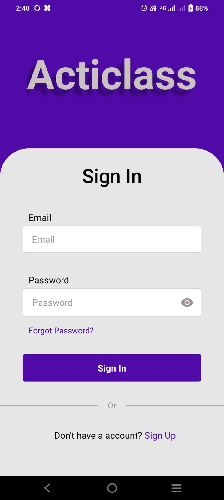
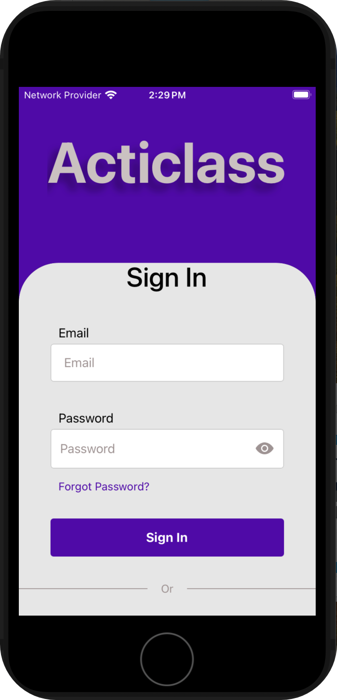
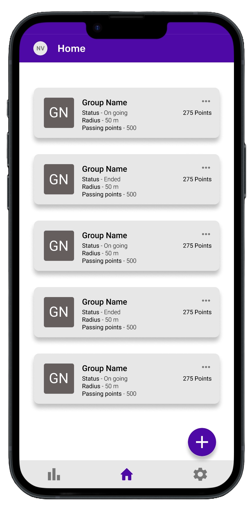
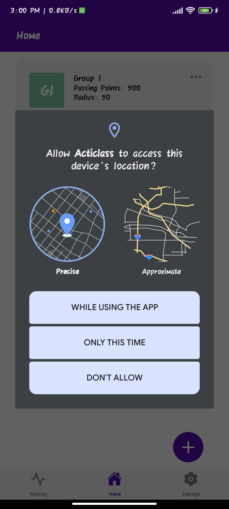
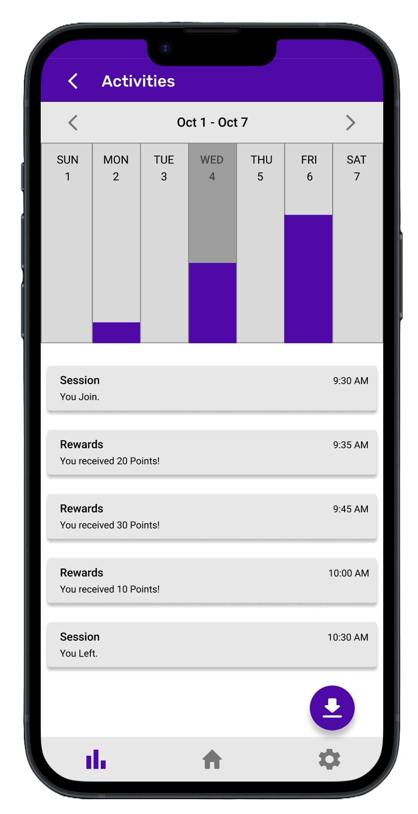
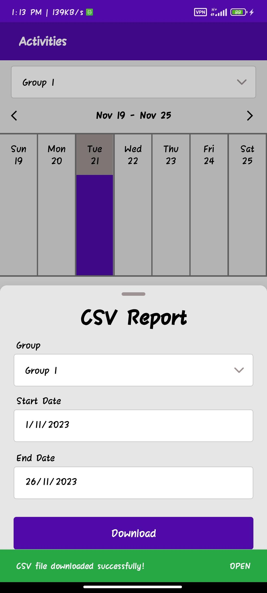
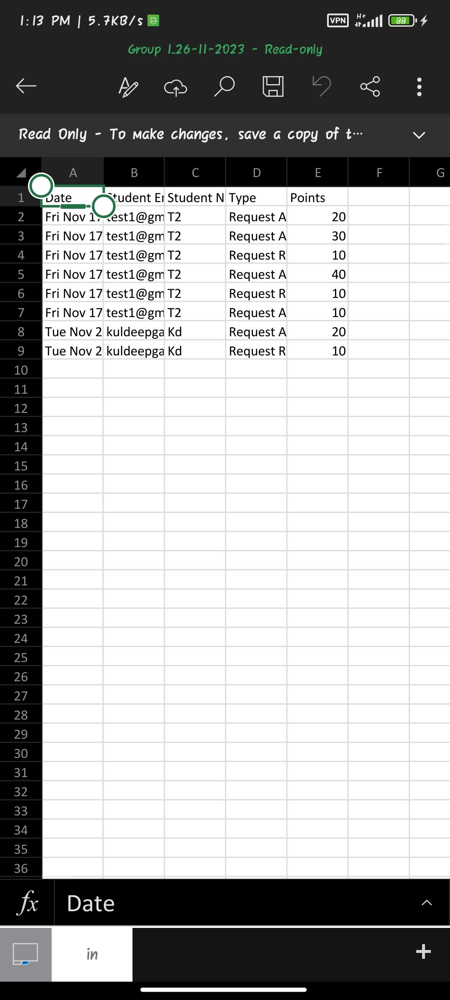
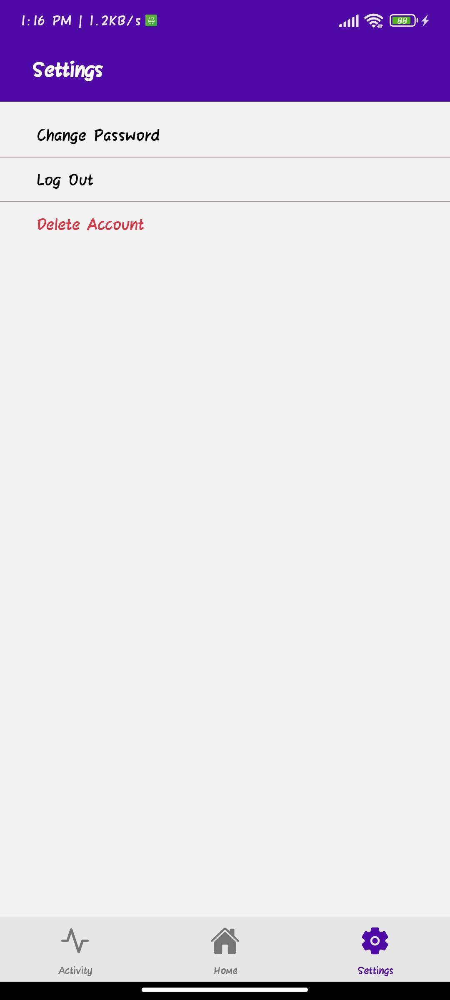
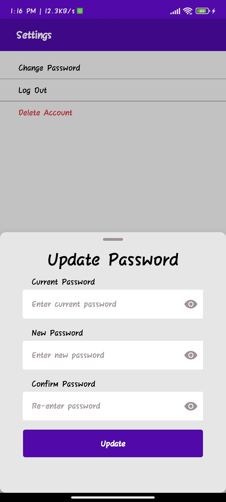
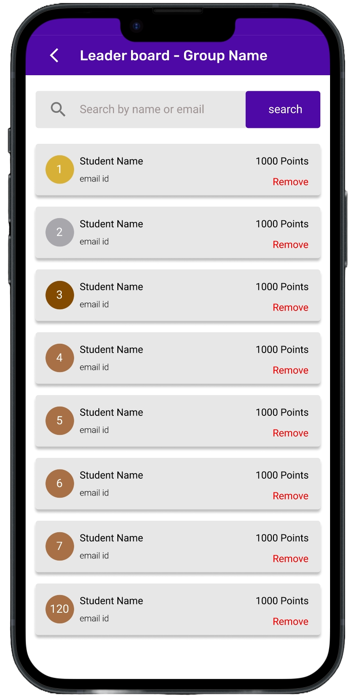

# Acticlass 

A mobile application designed to make more interactive participation in class between students and teacher with various features that are of benefit to both, enhancing the learning experience.

[](https://img.shields.io/badge/pipeline-passed-green)

## Instructions for Build/deployment

> **Note**: Make sure you have completed the [React Native - Environment Setup](https://reactnative.dev/docs/environment-setup).

### Deployment

To deploy the Acticlass server locally, Open a terminal in the [_Acticlass-API_](Acticlass-API/) directory of the Acticlass app.

- Run the following command:

  ```bash
  # installing reqired packages
  npm install

  # using npm
  npm start

  # OR using Yarn
  yarn start
  ```

Congratulations! You have successfully deployed the Acticlass server.

### Build

#### Step 1: Start the Metro Server

First, you will need to start **Metro**, the JavaScript _bundler_.

To start Metro, run the following command from the [_Acticlass-App_](Acticlass-App/).

```bash
# installing reqired packages
npm install

# using npm
npm start

# OR using Yarn
yarn start
```

#### Step 2: Start your Application

Let Metro Bundler run in its _own_ terminal. Open a _new_ terminal from the [_Acticlass-App_](Acticlass-App/). Run the following command to start your _Android_ or _iOS_ app:

##### For Android

```bash
# using npm
npm run android

# OR using Yarn
yarn android
```

##### For iOS

```bash
# using npm
npm run ios

# OR using Yarn
yarn ios
```

This is one way to run your app — you can also run it directly from within Android Studio and Xcode respectively.

### Congratulations! :tada:

You've successfully deployed Acticlass App. :partying_face:

## Dependencies

### Dependencies for Server

Below is the list of Dependencies that are required to run the server for the server.
| Dependency | Version | Description |
|----------------|----------------|-------------|
| bcrypt | ^5.1.1 | A library to help you hash passwords. |
| dotenv | ^16.3.1 | Loads environment variables from a `.env` file into `process.env`. |
| express | ^4.18.2 | Fast, unopinionated, minimalist web framework for Node.js. |
| http | ^0.0.1-security| HTTP interface for Node.js (though this seems to be a placeholder version). |
| http-status | ^1.7.0 | Utility to interact with HTTP status code. |
| jsonwebtoken | ^9.0.2 | Implementation of JSON Web Tokens for secure data transmission. |
| lodash | ^4.17.21 | A modern JavaScript utility library delivering modularity, performance, & extras. |
| moment | ^2.29.4 | Library for parsing, validating, manipulating, and formatting dates. |
| mongoose | ^7.6.0 | Mongodb object modeling for Node.js. |
| node-cache | ^5.1.2 | Simple in-memory cache for Node.js. |
| node-schedule | ^2.1.1 | A cron-like and not-cron-like job scheduler for Node. |
| nodemailer | ^6.9.6 | Module for Node.js applications to allow easy email sending. |
| socket.io | ^4.7.2 | Enables real-time bidirectional event-based communication. |

### Dependencies for application

Below is the list Dependencies that are required to run the application using React Native
| Dependency | Version | Description |
|----------------------------------------------|----------|-------------|
| @react-native-community/datetimepicker | ^7.6.1 | Provides date and time picker components for React Native. |
| @react-native-community/masked-view | ^0.1.11 | A component for masking views in React Native. |
| @react-navigation/bottom-tabs | ^6.5.10 | Navigation component for bottom tab navigation in React Native apps. |
| @react-navigation/elements | ^1.3.20 | Provides essential building blocks for React Navigation. |
| @react-navigation/native | ^6.1.8 | Core utilities for React Navigation library. |
| @react-navigation/stack | ^6.3.18 | Stack navigator component for handling screen transitions. |
| axios | ^1.5.1 | Promise-based HTTP client for making HTTP requests. |
| events | ^3.3.0 | Provides event emitter functionality. |
| formik | ^2.4.5 | Library for building and managing forms. |
| geodist | ^0.2.1 | Library to calculate distances between geographic coordinates. |
| json-query | ^2.2.2 | Module for making JSON queries. |
| lodash | ^4.17.21 | A modern JavaScript utility library delivering modularity, performance, & extras. |
| moment | ^2.29.4 | Library for parsing, validating, manipulating, and formatting dates. |
| pubsub-js | ^1.9.4 | Publish/Subscribe pattern implementation for loosely coupled communication. |
| radio-buttons-react-native | ^1.0.4 | Radio buttons component for React Native. |
| randomcolor | ^0.6.2 | Color generator for JavaScript. |
| react | 18.2.0 | A JavaScript library for building user interfaces. |
| react-csv-downloader | ^3.0.0 | Component for downloading CSV files. |
| react-native | 0.72.5 | Framework for building native apps using React. |
| react-native-app-intro-slider | ^4.0.4 | Intro slider component for React Native applications. |
| react-native-elements | ^3.4.3 | Cross Platform React Native UI Toolkit. |
| react-native-geolocation-service | ^5.3.1 | Geolocation service for React Native. |
| react-native-gesture-handler | ^2.13.1 | Declarative API for handling gestures in React Native. |
| react-native-mmkv | ^2.10.2 | An efficient, small mobile key-value storage framework. |
| react-native-permissions | ^3.10.1 | A unified permissions API for React Native on iOS and Android. |
| react-native-popup-menu | ^0.16.1 | Customizable popup menus for React Native. |
| react-native-qrcode-svg | ^6.2.0 | QR Code generator for React Native. |
| react-native-raw-bottom-sheet | ^2.2.0 | Customizable bottom sheet component for React Native. |
| react-native-safe-area-context | ^4.7.2 | A flexible way to handle safe area, also works on Android and Web! |
| react-native-screens | ^3.25.0 | Native navigation primitives for your React Native app. |
| react-native-select-dropdown | ^3.4.0 | A highly customizable dropdown component for React Native. |
| react-native-snackbar | ^2.6.2 | Snackbar component for Android and iOS React Native apps. |
| react-native-svg | ^13.14.0 | SVG library for React Native. |
| react-native-url-polyfill | ^2.0.0 | A URL polyfill for React Native. |
| react-native-vector-icons | ^10.0.2 | Customizable Icons for React Native with support for NavBar/TabBar, image source and full styling. |
| react-native-vision-camera | ^3.6.4 | Camera capabilities for React Native. |
| socket.io-client | ^4.7.2 | Client-side library for Socket.io, a real-time bidirectional event-based communication library. |
| yup | ^1.3.2 | Schema builder for value parsing and validation. |

### Developer Dependencies

Below is the list of Dependencies used in the project for development.

| Dependency                      | Version  | Description                                                                                                                 |
| ------------------------------- | -------- | --------------------------------------------------------------------------------------------------------------------------- |
| @babel/core                     | ^7.20.0  | JavaScript compiler core that helps to transform ES6 code to an older version for compatibility.                            |
| @babel/preset-env               | ^7.20.0  | A Babel preset that automatically determines the Babel plugins and polyfills you need based on your supported environments. |
| @babel/runtime                  | ^7.20.0  | Provides Babel's helper functions and a runtime for regenerator.                                                            |
| @react-native/eslint-config     | ^0.72.2  | ESLint configuration for React Native projects.                                                                             |
| @react-native/metro-config      | ^0.72.11 | Configuration for Metro, the JavaScript bundler for React Native.                                                           |
| @tsconfig/react-native          | ^3.0.0   | A base TypeScript configuration for React Native projects.                                                                  |
| @types/react                    | ^18.0.24 | TypeScript definitions for React.                                                                                           |
| @types/react-test-renderer      | ^18.0.0  | TypeScript definitions for react-test-renderer.                                                                             |
| babel-jest                      | ^29.2.1  | Jest plugin to transform Babel code.                                                                                        |
| eslint                          | ^8.19.0  | An AST-based pattern checker for JavaScript.                                                                                |
| jest                            | ^29.7.0  | JavaScript testing framework with a focus on simplicity.                                                                    |
| metro-react-native-babel-preset | 0.76.8   | A Babel preset for React Native applications.                                                                               |
| prettier                        | ^2.4.1   | An opinionated code formatter for various languages, including JavaScript.                                                  |
| react-test-renderer             | 18.2.0   | Render React components for testing.                                                                                        |
| typescript                      | 4.8.4    | A typed superset of JavaScript that compiles to plain JavaScript.                                                           |
| nodemon                         | ^3.0.1   | A utility that monitors for any changes in your source and automatically restarts your server.                              |

## Features :star2:

### 1. Cross-Platform Compatibility

- **Compatibility:** The app is compatible both on Android and iOS devices.
  <p align='center'>
  
  

</p>

### 2. Group Creation and Management
- **Teacher:**  <br>The user with the teacher role can create, configure, and delete the group. Teachers can also remove a user from the group. If the session of groups is active for more than 6 hours the session automatically ends. 

- **Student:** <br> Students can join the group using a QR code scanner integrated with the app. Can also leave the group. 

  <p align='center'>
  
</p>


### 3. Riser Requests and Custom Rewards

- **Student:**
  The student can raise a request for a reward when is in a session.

- **Teacher:**
  In the session, the teacher can approve or decline the request raised by the student. While approving the reward, the teacher can customize the reward value with suggested values or with a custom input accordingly. If the teacher does not approve or reject the request of the student for more than 5 minutes the request will automatically get rejected and the student will be penalized.

### 4. Attendance Tracking

- **Feature:** The app checks whether the student is active in the group or not in particular intervals, where the interval is the attendance frequency set when the user with role teacher group configured or created the group. The student will be awarded points that are set by the teacher for attendance.

### 5. Geofencing Feature

- **Teacher:**
  The teacher can set a geofence range while creating the group or can configure it later on. When the teacher starts the session, the teacher's location becomes the group location for the session.

- **Student:**
  The student must be in the geofence range that is set by the teacher to join the session, if the student moves out of the geofence, the student automatically gets disconnected from the session.

    <p align='center'>
  
</p>

### 6. Activity Screen

- **Teacher:**
  On the activity screen, the teacher will be able to select any particular group that the teacher is a part of. The stats are displayed in the form of bar graphs for an entire week and can be selected for any day of the week to get the activities as a list of that particular day, which holds attendance, rewards and penalties for every student.

- **Student:**
On the activity screen, the student will be able to see all his/her activities, such as attendance rewards and penalties for any week and group that the student is part of. The list of activities is displayed for any particular day selected in the week.

  <p align='center'>
  
</p>

### 7. CSV Reporting Download

- **Both Teacher and Student:**
  Both teacher and student have the option to download all their activities on the activity screen as a report with a CSV file type.
    <p align='center'>
  
  

</p>

### 8. Account Management

- **Features:**
  Features like signing in, signing up, delete account and forgot password are included. I forgot password the user gets a verification code to their email Which is valid for 5 minutes and can reset their password.

    <p align='center'>
  
  

</p>

### 9. Leaderboard

- **Access:**
  Any user can access the leaderboard of the group that is part of, where the user will be able to see a list of students in descending order of the points they have earned.

  <p align='center'>
  
</p>

## Credits :clap:

### Developer Team

| Name                                | Email           |
| ----------------------------------- | --------------- |
| KRISHNA VAIBHAV YADLAPALLI          | kr732880@dal.ca |
| KULDEEP RAJESHBHAI GAJERA           | kl210309@dal.ca |
| NISARG SHARADKUMAR VAGHELA          | nvaghela@dal.ca |
| SHYAMAL PRAJAPATI                   | sgp@dal.ca      |
| VENKATA SREENIVAS PRASAD KASIBHATLA | vn769140@dal.ca |

### Client Team

| Name                             | Email           |
| -------------------------------- | --------------- |
| Mohammed Noor Ul Hasan Kothaliya | mh478572@dal.ca |
| RahulPuri                        | rh917388@dal.ca |
| Samit Mhatre                     | sm904139@dal.ca |
| Suyash Jhawer                    | sy326775@dal.ca |
| Vishaka Vinod                    | vs235403@dal.ca |

> Under the Supervison of
 [Dr. Tushar Sharma](https://tusharma.in/) (Professor)
 [Mootez Saad](https://www.linkedin.com/in/mootez-saad-118aa2151) (Head Teaching Assitant)
